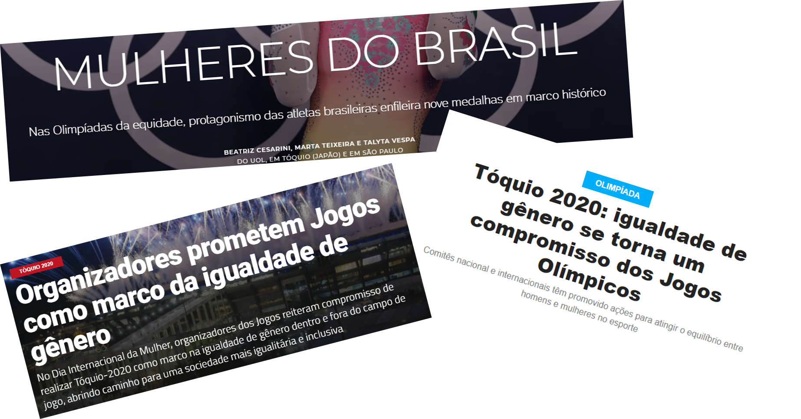

# Equidade de Gênero nas Olímpiadas

Olá! Espero que esteja bem.

No notebook presente neste diretório, encontra-se uma análise dos dados sobre a equidade nas olímpiadas abrangendo principalmente a participação de cada gênero ao longo das edições dos jogos de verão. Vale ressaltar que este parâmetro é apenas uma pequena parte de todo o universo de equidade e ainda há muito a ser feito.

Durante as Olímpiadas de Tóquio, noticiou-se a todo momento de que essa edição era histórica por se ter o maior percentual de mulheres competindo desde o início da competição. 
 

 
 

 
 

 
 

  Daí surgiu a curiosidade de entender como era a distribuição ao longo do tempo e qual a motivação desse valor ainda não ser 50%.
  
**Fonte dos Dados:**
  - [120 Olympic History: athletes and results](https://www.kaggle.com/heesoo37/120-years-of-olympic-history-athletes-and-results)
  - [2021 Olympics in Tokyo](https://www.kaggle.com/arjunprasadsarkhel/2021-olympics-in-tokyo)
  

